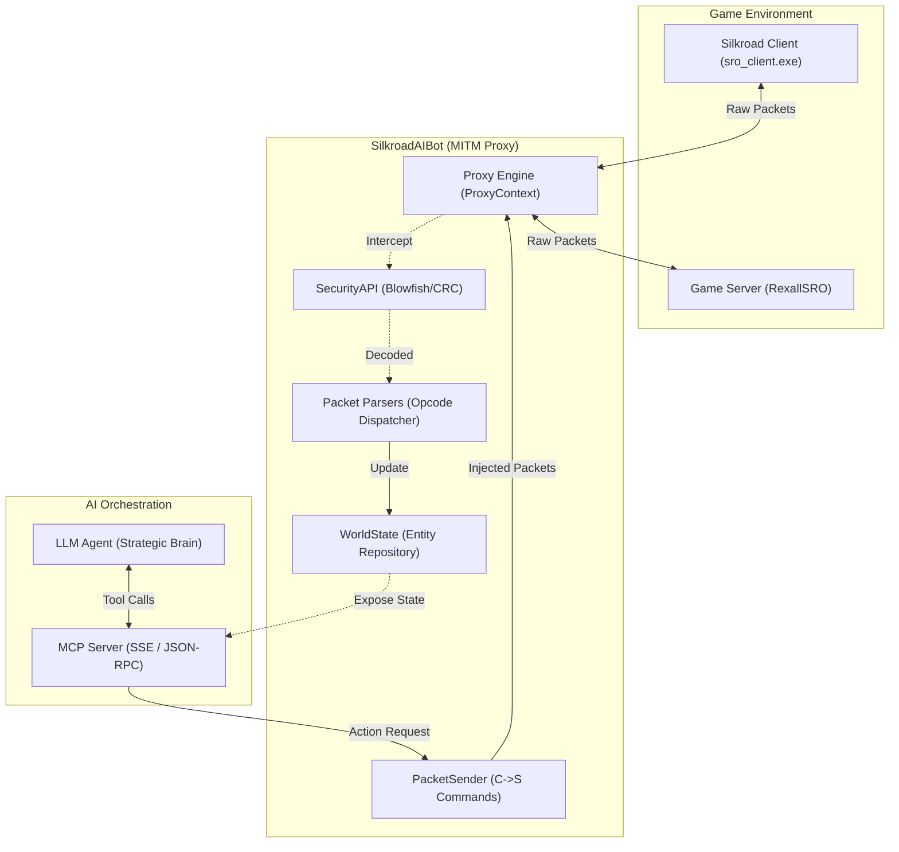

# SilkroadAIBot — Technical Design Document (TDD)

## Executive Summary
`SilkroadAIBot` is a next-generation automation and orchestration platform for Silkroad Online (specifically targeting the RexallSRO private server). Unlike traditional "injection" bots, `SilkroadAIBot` operates as a high-performance **Man-In-The-Middle (MITM) Proxy**. 

The system intercepts encrypted game traffic, maintains a real-time synchronized **World Model** (entities, positions, inventory), and exposes this state through a **Model Context Protocol (MCP)** server. This allows Large Language Models (LLMs) or strategic AI agents to observe the game world and issue high-level directives (e.g., "farm this area", "prioritize looting", "retreat if HP < 30%") which the bot then executes through a low-level packet-sending engine.

---

## System Architecture

The project follows **Clean Architecture** principles to separate core domain logic from infrastructure concerns (like networking and database access).

### High-Level Component Diagram

---

## Tech Stack & Dependencies

| Component | Technology | Rationale |
| :--- | :--- | :--- |
| **Core Framework** | `.NET 8.0 (C#)` | Modern, high-performance runtime with excellent async support. |
| **Architecture** | `Clean Architecture` | Ensures testability and separates Domain from Infrastructure. |
| **Networking** | `TCP Sockets / Channels` | Low-latency packet handling and asynchronous streaming. |
| **Security** | `Blowfish / CRC32` | Implementation of the Silkroad "SecurityAPI" for packet encryption. |
| **Persistence** | `SQLite / Dapper` | Lightweight local storage for PK2 data (items, skills, models). |
| **AI Interface** | `MCP (Model Context Protocol)` | Standardized protocol for connecting LLMs to the bot's toolset. |
| **UI** | `Windows Forms (WinForms)` | Native Windows interface for the dashboard and packet sniffer. |
| **Build Target** | `x86` | Required for compatibility with Silkroad's 32-bit memory and network structures. |

---

## Component Design

### 1. Domain Layer (`Domain/`)
Contains pure, immutable records and enums that define the Silkroad world.
- `SREntity`: Represents any object in the world (Player, Monster, NPC, Item).
- `SRCoord`: A coordinate system handling Silkroad's unique `RegionID/X/Y/Z` format.
- `SRSkill` & `SRItem`: Definitions for character capabilities and inventory.

### 2. Application Layer (`Application/`)
Defines the business rules and interfaces.
- `IWorldStateRepository`: Interface for managing the live entity list.
- `IBotBundle`: Interface for modular behaviors (Attack, Recovery, Loot).
- `IMcpToolProvider`: Defines the tools exposed to the AI Agent.

### 3. Infrastructure Layer (`Infrastructure/`)
Handles the heavy lifting of networking and data parsing.
- `ProxyContext`: Manages the lifecycle of a connection (Gateway vs. Agent legs).
- `PacketParser`: Translates raw byte streams into Domain objects using opcode-specific logic.
- `Pk2DataExtractor`: Parses the game's `.pk2` files to populate the local database with object names and stats.

### 4. Presentation Layer (`UI/` & `McpServer/`)
- **Dashboard UI**: Real-time status, map view, and manual controls.
- **MCP Server**: An ASP.NET Core minimal API that provides an SSE stream for the AI agent to subscribe to world updates.

---

## Data Flow & Networking

### Packet Lifecycle
1. **Interception**: `ProxyContext` receives encrypted bytes from the Client.
2. **Decryption**: `SecurityAPI` uses a Blowfish key to decrypt the payload.
3. **Dispatch**: The `PacketDispatcher` identifies the opcode (e.g., `0x3015` for Spawn) and routes it to the correct `IPacketHandler`.
4. **State Update**: The handler updates the `WorldState` (e.g., adds a new `SREntity` to the `ConcurrentDictionary`).
5. **Observation**: The `McpServer` detects the change and notifies the AI Agent via an SSE event.

### C->S Command Flow
1. **Decision**: The AI Agent decides to cast a skill.
2. **Tool Call**: The Agent calls the `cast_skill` tool on the MCP Server.
3. **Construction**: `PacketSender` builds a `0x7074` packet with the TargetUID and SkillID.
4. **Encryption**: `SecurityAPI` encrypts the packet and calculates the CRC.
5. **Injection**: `ProxyContext` injects the packet into the Agent leg stream towards the Game Server.

---

## Security & Error Handling

### Network Security
- **Handshake Emulation**: The bot fully replicates the 4-step security handshake (`0x5000` -> `0x2001`).
- **Locale Patching**: Automatically patches the client's locale byte from `0x00` to `0x16` (RexallSRO requirement) during login.
- **Heartbeat Management**: A background loop sends `0x2002` keepalive packets every 5 seconds to prevent server-side disconnection.

### Error Handling
- **Packet Overflow**: Uses `Bounded Channels` for packet queues to prevent memory exhaustion during lag spikes.
- **Malformed Packets**: All parsers are wrapped in `try-catch` blocks that log the hex dump of the offending packet without crashing the proxy.
- **Session Pruning**: Automatically detects dead sockets and removes stale `ProxyContext` instances from memory.

---

## Deployment / Setup

### Prerequisites
- .NET 8.0 SDK (x86)
- RexallSRO Game Client
- SQLite 3 runtime

### Installation Steps
1. **Build**: Run the `build.ps1` script to compile the solution for `x86`.
2. **Configure**: Edit `bot_config.json` with your server IP and credentials.
3. **Data Extraction**: Run the bot once and use the "Extract PK2" tool to generate the `SRO_Data.db` file from your game directory.
4. **Redirection**: 
   - Option A: Use the included `Redirector.dll` to hook `sro_client.exe`.
   - Option B: Edit the Windows `hosts` file to point the login server to `127.0.0.1`.
5. **Launch**: Start `SilkroadAIBot.exe` and then launch the Silkroad Client.

---
*Document Version: 2.0.0*
*Last Updated: 2026-04-28*
